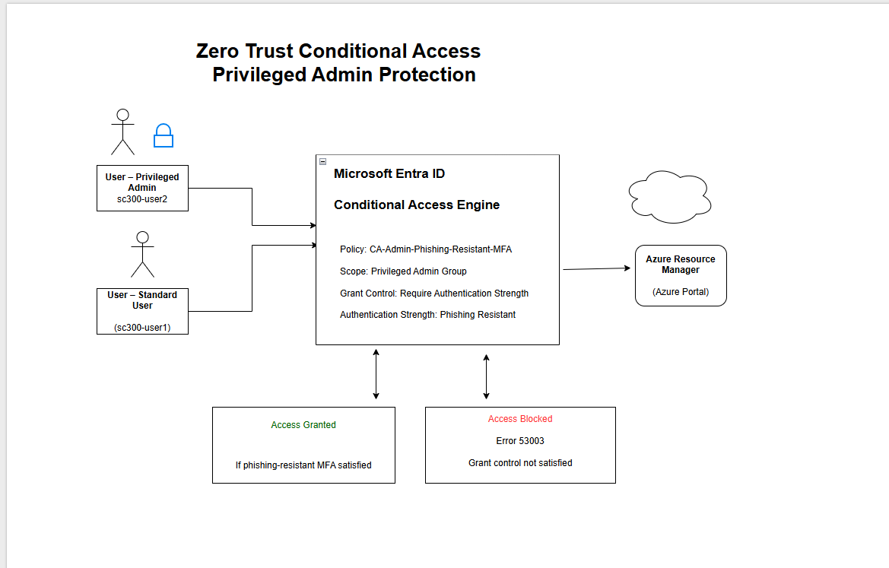

# Architecture – Zero Trust Conditional Access (Privileged Admin Protection)
## Diagram

This section explains the architecture behind the Zero Trust Conditional Access lab implemented in Microsoft Entra ID.

## Diagram Overview

The diagram shows how Microsoft Entra ID Conditional Access enforces phishing-resistant authentication for privileged administrators when accessing Azure Resource Manager (Azure Portal).

## Components

### Users
- **Privileged Admin (sc300-user2)**: Member of the Privileged Admin security group and targeted by the policy.
- **Standard User (sc300-user1)**: Not targeted by the privileged admin policy.

### Microsoft Entra ID – Conditional Access Engine
- **Policy**: CA-Admin-Phishing-Resistant-MFA  
- **Scope**: Privileged Admin Group  
- **Grant control**: Require Authentication Strength  
- **Authentication strength**: Phishing Resistant

### Protected Resource
- **Azure Resource Manager (Azure Portal)**: Access is allowed only if Entra ID issues a token that meets policy requirements.

## Access Decision Outcomes

### Access Granted
Access is granted when the privileged admin completes a phishing-resistant authentication method.

### Access Blocked
Access is blocked when the privileged admin does not meet the phishing-resistant authentication requirement.
Typical result:
- **Error 53003**
- **Grant control not satisfied**

## Validation Evidence

This architecture was validated using:
- Conditional Access policy evaluation results
- Sign-in logs showing Error 53003 for the privileged admin account
- Policy details confirming the authentication strength requirement
