# Policy Configuration and Validation Screenshots

This folder contains evidence of the Zero Trust Privileged Admin Conditional Access implementation, including identity preparation, authentication strength configuration, policy deployment, and enforcement validation.

---

## Phase 1 – Identity Preparation

### 01 – Privileged Admin Group Overview
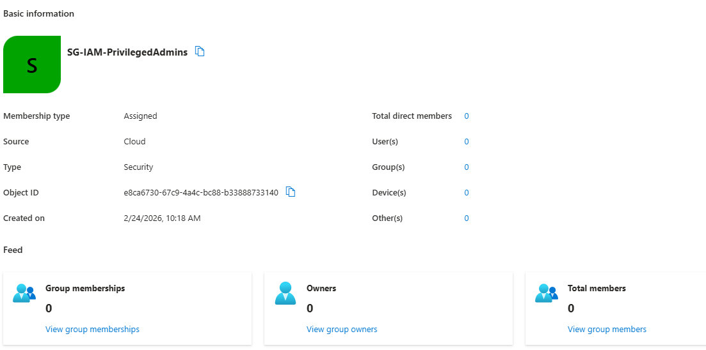

### 02 – All Security Groups
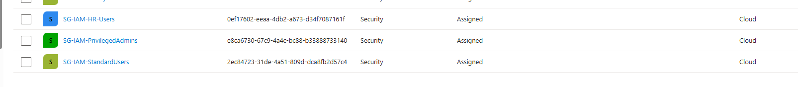

### 03 – Privileged Admin Membership
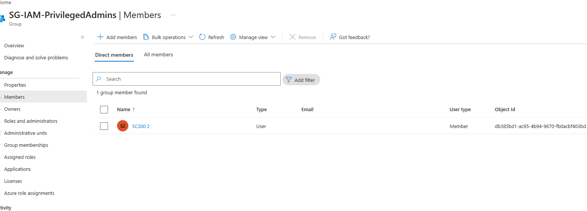

### 04 – HR User Membership
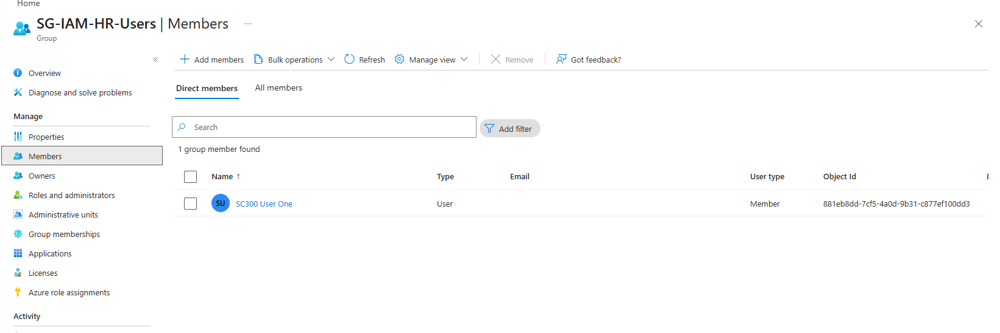

### 05 – Standard User Membership
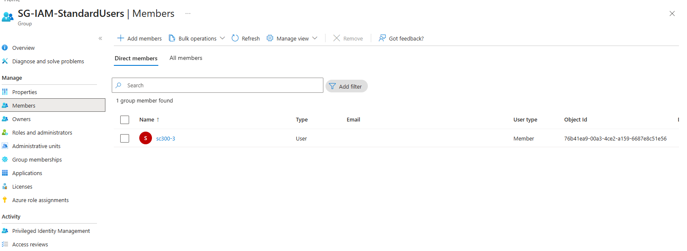

---

## Phase 2 – Control Design

### 06 – Named Location: Trusted UK Office
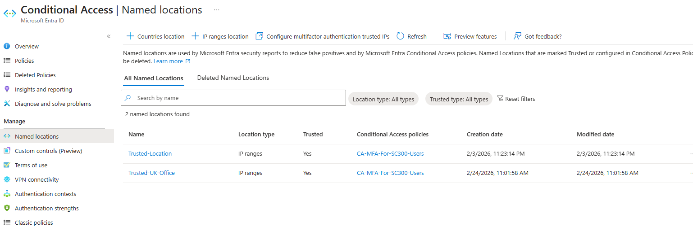

### 07 – Authentication Strength: Phishing Resistant
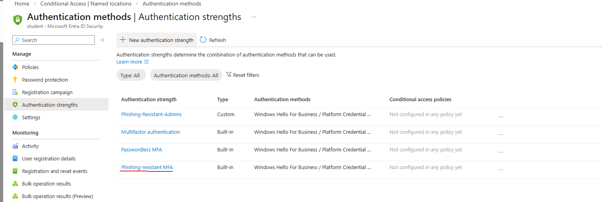

---

## Phase 3 – Conditional Access Configuration

### 08 – Grant Control: Require Authentication Strength
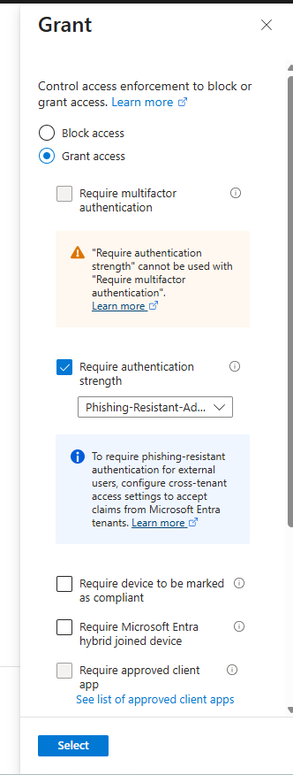

### 09 – Conditional Access Policy Created
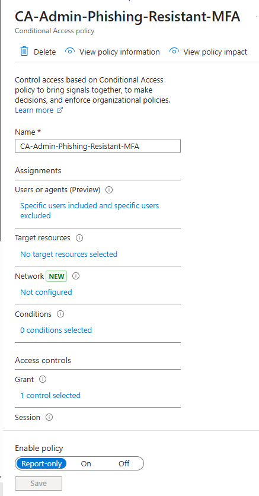

---

## Phase 4 – Enforcement and Validation

### 10 – Policy Evaluation Result
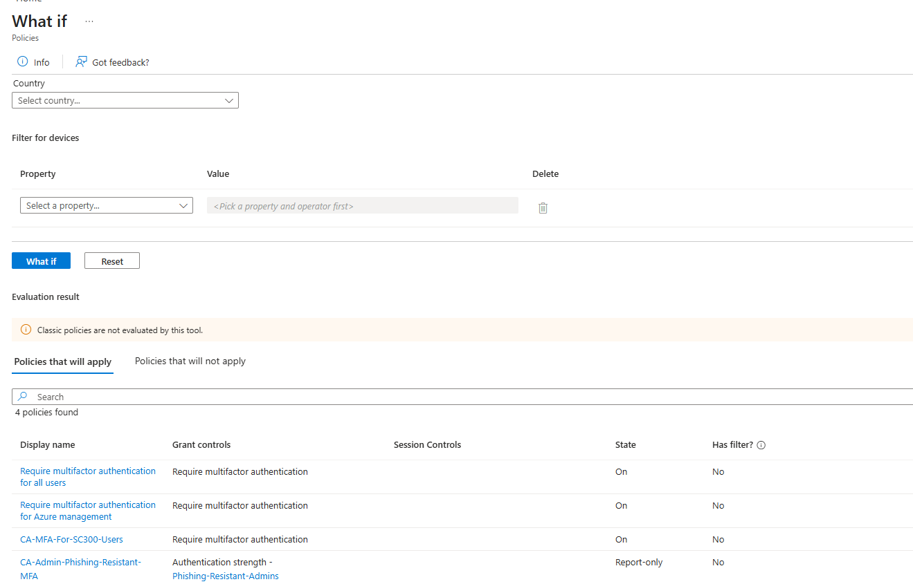

### 11 – Login Blocked Due to Authentication Strength Requirement
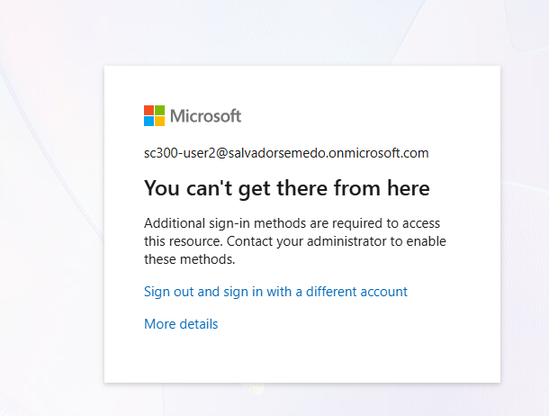

### 12 – Sign-in Failure (Error 53003)
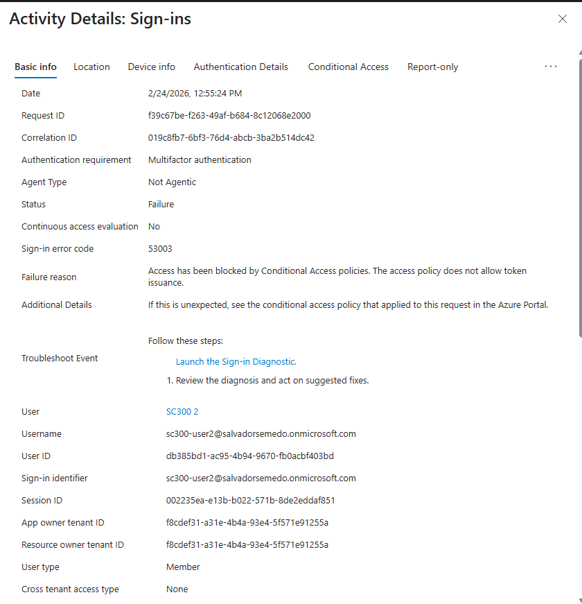

### 13 – Conditional Access Grant Control Not Satisfied
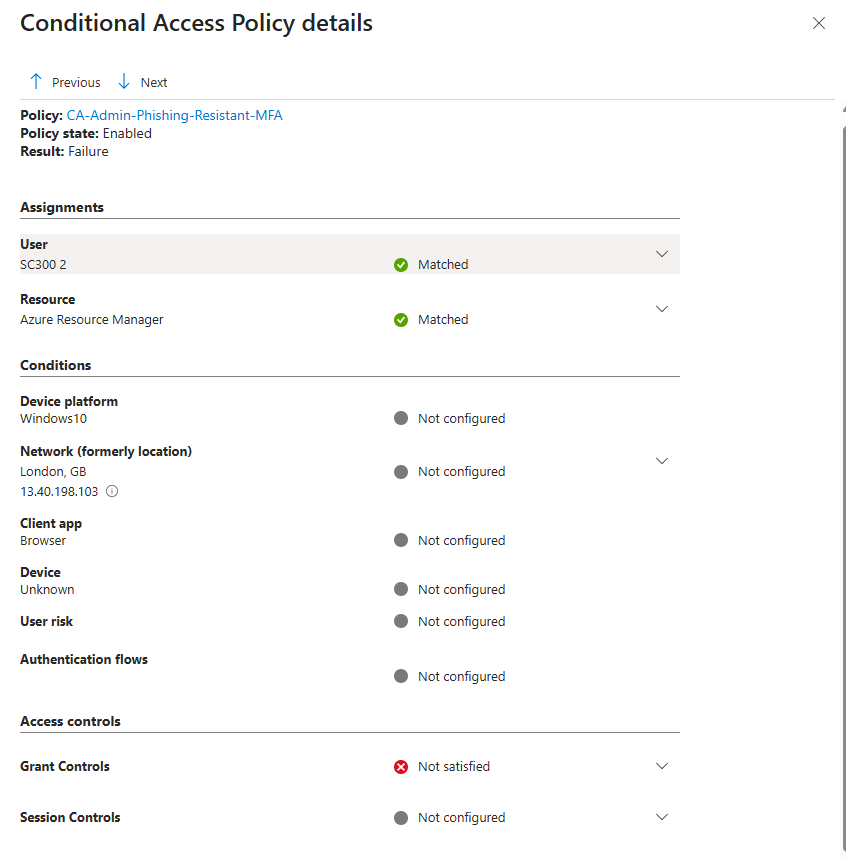
